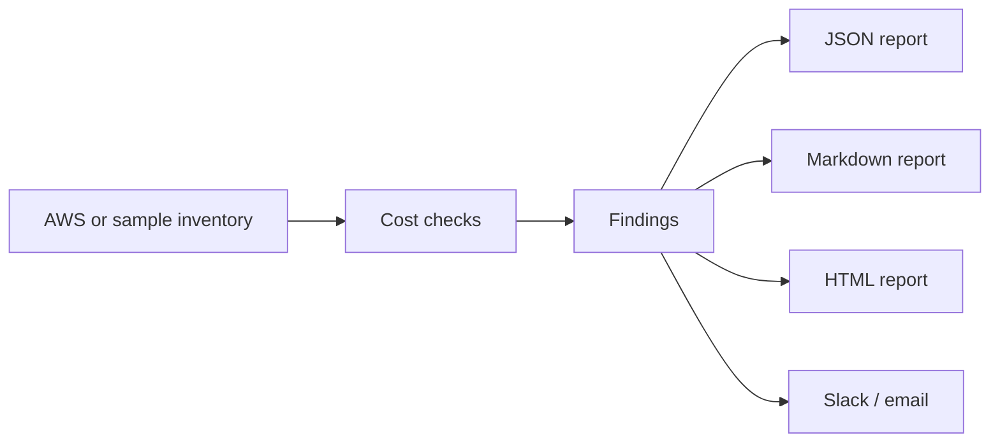

# Cloud Cost Optimization Toolkit

[](https://github.com/mrsddq/cloud-cost-optimization-toolkit/actions/workflows/ci.yml)

Python toolkit for finding common AWS waste: idle EC2 instances, unattached EBS volumes, old snapshots, unused load balancers, missing tags, and oversized instances.

The default demo mode runs entirely from a sample inventory file, so reviewers can test it without AWS credentials.

## What This Builds

- CLI with JSON, Markdown, and HTML reports
- Dry-run mode for safe review
- Offline sample inventory for demos and tests
- Optional Boto3 collection path for real AWS accounts
- Checks for idle EC2, unattached EBS, old snapshots, unused load balancers, untagged resources, and oversizing
- Slack and email notification helpers
- Dockerized local demo and Docker Smoke CI
- Read-only security scan that blocks committed secrets and mutating AWS calls
- Unit tests for checks, reporting, and CLI behavior

## Quick Start

```bash
python -m cost_optimizer.cli --inventory examples/sample_inventory.json --format markdown --dry-run
```

Write a report:

```bash
python -m cost_optimizer.cli \
  --inventory examples/sample_inventory.json \
  --config config/example.json \
  --format html \
  --output report.html \
  --dry-run
```

Run tests:

```bash
make test
```

Docker demo:

```bash
docker compose up --build
```

## Portfolio Evidence

See [docs/PORTFOLIO_EVIDENCE.md](docs/PORTFOLIO_EVIDENCE.md) for sample report output, validation commands, and FinOps proof points.

## Production Docs

- [Architecture](docs/architecture.md)
- [Runbook](docs/runbook.md)
- [Incident response](docs/incident-response.md)
- [Cost estimate](docs/cost-estimate.md)
- [Security controls](docs/security-controls.md)

## Make Targets

```bash
make test
make validate
make lint
make security-scan
make local-demo
make deploy
make destroy
```

`deploy` and `destroy` are intentionally no-op guardrails because the toolkit is read-only by default.

## Interview Story

This project demonstrates Python automation for AWS cost governance, safe dry-run reporting, Dockerized execution, CI validation, read-only security guardrails, stakeholder-friendly reports and production-style review runbooks.

## Example Findings

- Running EC2 instance below the CPU threshold for 14 days
- EBS volume in `available` state
- Snapshot older than the retention policy
- Load balancer with zero requests or zero healthy targets
- Resource missing required tags such as `Owner` or `CostCenter`
- Large instance that should be rightsized based on utilization

## Architecture



## What This Proves

- Practical Python automation for cloud operations
- AWS cost and tagging governance awareness
- Safe dry-run workflows
- Report generation for engineering and finance stakeholders
- Testable code structure instead of one-off scripts

## AWS Mode

Install optional dependencies, configure AWS credentials through SSO or an assumed role, then run:

```bash
pip install ".[aws]"
python -m cost_optimizer.cli --from-aws --region us-east-1 --format markdown --dry-run
```

Use read-only IAM permissions first. Do not add cleanup actions until findings are reviewed.

## Cost And Safety Note

The sample inventory mode is free. AWS mode should run with read-only permissions, account allowlists, tagged ownership, reviewed thresholds and durable report storage before any cleanup workflow is added.
