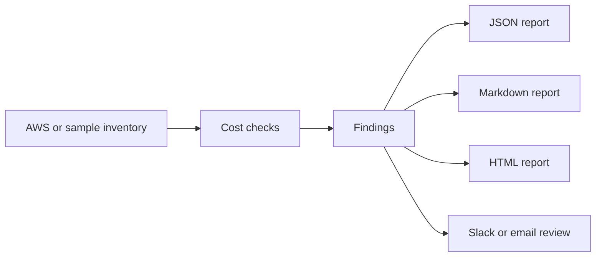
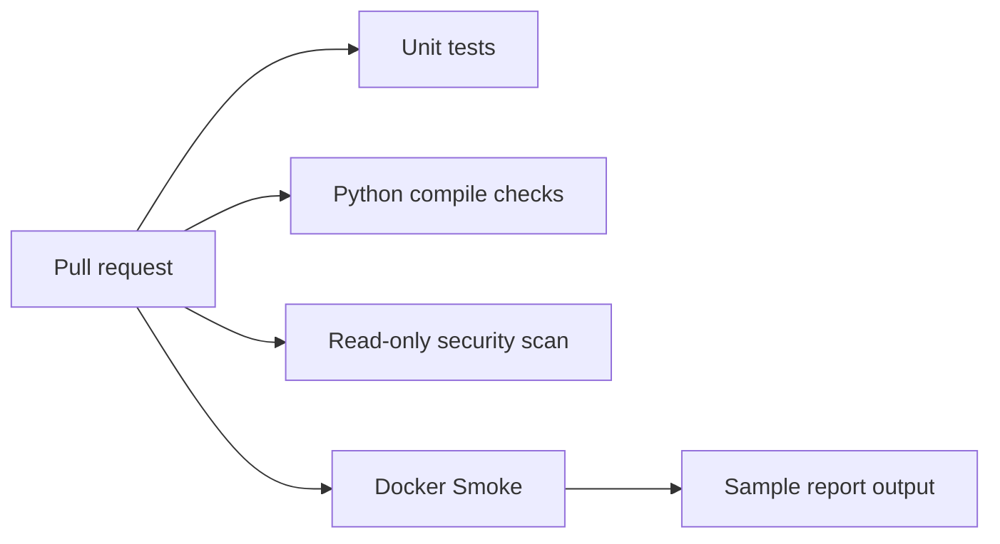
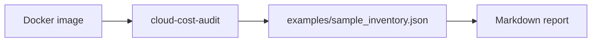

# Architecture

## High-Level Flow

## CI/CD Flow

## Local Demo Flow

## Safety Model

The toolkit is read-only by default. It reports opportunities rather than deleting, stopping, resizing or tagging resources. Cleanup automation should be added only behind approvals, ticket links, allowlists and change windows.

## AWS Collection

The AWS adapter collects inventory through Boto3. Cost values and utilization placeholders should be enriched from Cost Explorer and CloudWatch in a production rollout.

## Extension Points

- Add Cost Explorer monthly spend enrichment.
- Add CloudWatch utilization windows per account and region.
- Write findings to S3 or an internal ticketing system.
- Add allowlisted remediation workflows after approval.
